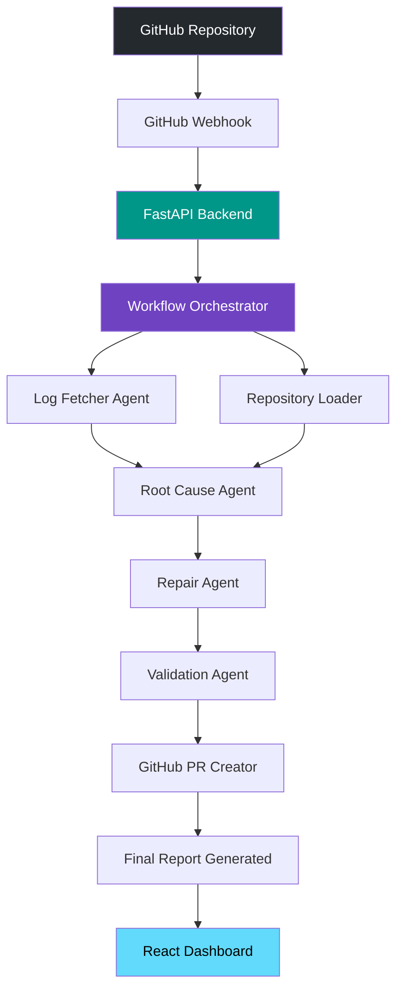
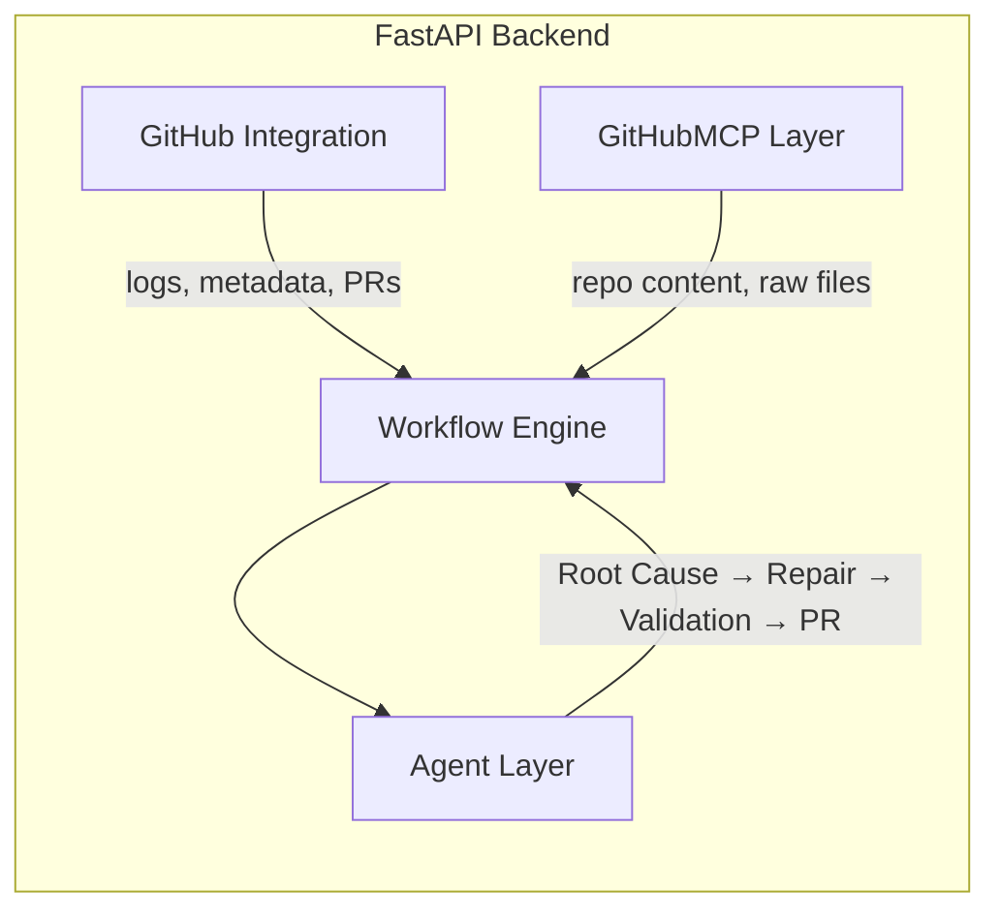
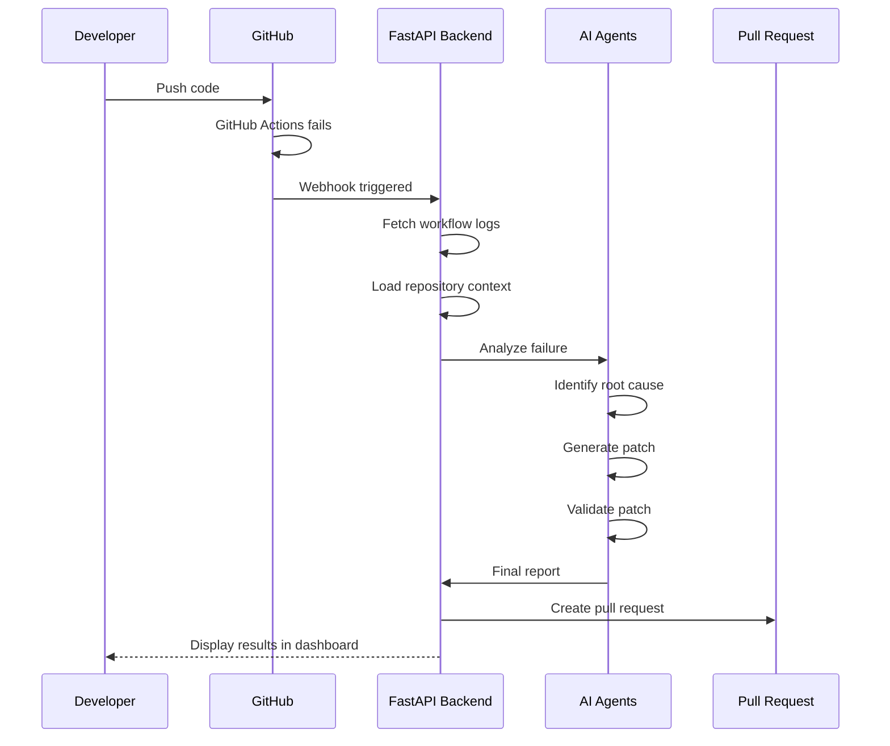
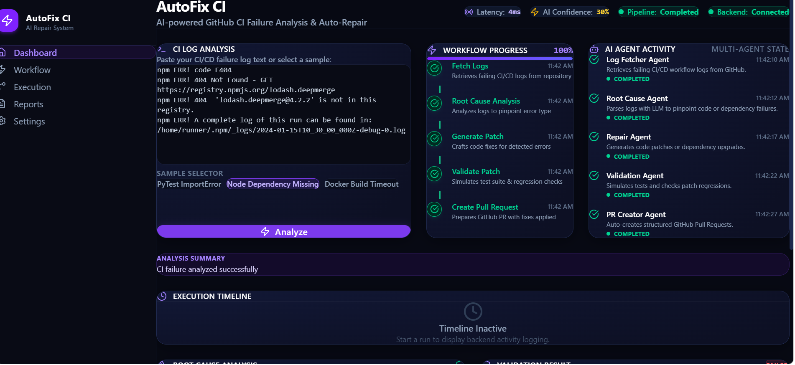
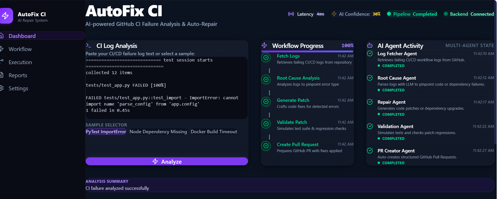
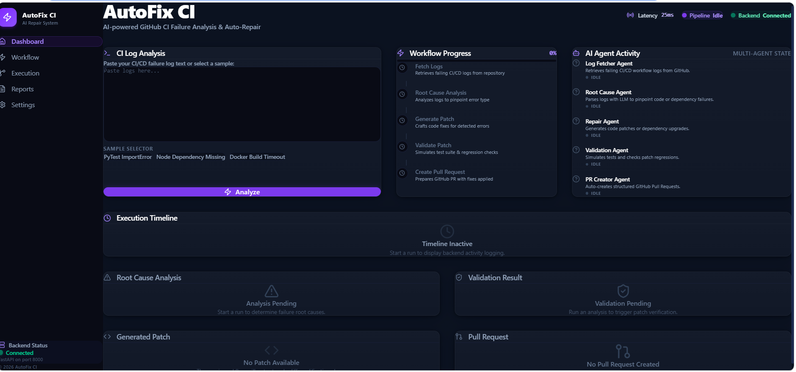

# 🤖 AutoFix CI

### AI-Powered GitHub CI Failure Analysis & Auto Repair Platform

**AutoFix CI** automatically analyzes failing GitHub Actions workflows, identifies root causes using LLMs, generates repair patches, validates fixes, and opens Pull Requests — with minimal developer intervention.

<p align="center">
  
  
  
  
  
  
  
  
  
</p>

---

## 📚 Table of Contents

- [Overview](#-overview)
- [Course Concepts Demonstrated](#-course-concepts-demonstrated)
- [Problem Statement](#-problem-statement)
- [Key Features](#-key-features)
- [Architecture](#-architecture)
- [Workflow](#-workflow)
- [Tech Stack](#-tech-stack)
- [Project Structure](#-project-structure)
- [Getting Started](#-getting-started)
  - [Prerequisites](#prerequisites)
  - [Backend Setup](#backend-setup)
  - [Frontend Setup](#frontend-setup)
  - [Environment Variables](#environment-variables)
- [API Documentation](#-api-documentation)
- [Screenshots](#-screenshots)
- [Testing](#-testing)
- [Security](#-security)
- [Known Issues](#-known-issues)
- [Roadmap](#-roadmap)
- [Contributing](#-contributing)
- [Acknowledgements](#-acknowledgements)
- [License](#-license)

---

## 🔍 Overview

Modern software teams rely heavily on Continuous Integration pipelines, but when builds fail, developers lose significant time inspecting logs, reproducing failures, writing fixes, validating them, and opening pull requests.

**AutoFix CI** automates this entire debugging loop using a coordinated team of AI agents that fetch logs, understand repository context, diagnose root causes, generate patches, validate them, and ship a pull request — all with a live dashboard to watch it happen.

## 🧠 Course Concepts Demonstrated

AutoFix CI was built as part of Google & Kaggle's 5-Day AI Agents Intensive Course, and applies the following key concepts covered in the course:

| Concept | Where Demonstrated | Details |
|---|---|---|
| **Multi-Agent System** | Code (`app/agents/`) | A custom Python orchestrator coordinates five single-responsibility agents (Log Fetcher, Root Cause, Repair, Validation, PR Creator), each passing structured output to the next stage. |
| **MCP Server** | Code (`app/mcp/`) | `GitHubMCP` implements the Model Context Protocol to give agents structured access to repository content — raw file retrieval, Base64 fallback decoding, and binary detection — rather than ad-hoc API calls. |
| **Security Features** | Code (`app/integrations/`, `app/mcp/`) | HMAC-SHA256 webhook signature verification with constant-time comparison, canonical path validation to prevent traversal attacks, safe ZIP extraction, and a custom exception hierarchy for graceful failure handling. |
| **Antigravity** | Video | Google's Antigravity IDE was used during development to accelerate agent scaffolding and iteration — shown in the submission video. |

> **Note:** The multi-agent orchestration in this project uses a custom Python workflow engine rather than Google's Agent Development Kit (ADK). The agent design principles (single-responsibility agents, structured handoffs, sequential reasoning) follow the same patterns taught in the course.

## 🧩 Problem Statement

When CI builds fail, developers typically have to:

- 🔎 Inspect GitHub Actions logs
- 🐛 Locate the root cause
- 🔁 Reproduce the failure locally
- 🛠️ Write a fix
- ✅ Validate the fix
- 📬 Open a pull request

This repetitive process slows down delivery. AutoFix CI removes the manual toil by orchestrating AI agents that fetch workflow logs, analyze failures, understand repo context, generate fixes, validate patches, and automatically create GitHub Pull Requests.

## ✨ Key Features

### 🔗 GitHub Integration
- GitHub Webhook support
- GitHub Actions log fetching
- Repository context loading
- Automated Pull Request creation
- Full GitHub REST API integration

### 🧠 AI Pipeline
- CI log analysis
- Root cause detection
- Repository context understanding
- Patch generation
- Patch validation
- Risk assessment
- PR content generation

### 🕸️ Multi-Agent Architecture
Each agent owns a single responsibility:

| Agent | Responsibility |
|---|---|
| 🪵 **Log Fetcher Agent** | Retrieves and normalizes CI logs |
| 🎯 **Root Cause Agent** | Diagnoses the underlying failure |
| 🛠️ **Repair Agent** | Generates a candidate patch |
| ✅ **Validation Agent** | Validates the patch and assesses risk |
| 📬 **PR Creator Agent** | Opens the pull request on GitHub |

### 🖥️ Frontend Dashboard
A modern SaaS-style dashboard built with React, featuring:
- CI log input with sample failure logs
- Real-time workflow progress
- AI agent activity feed
- Execution timeline
- Root cause visualization
- Generated patch viewer with syntax highlighting
- Validation results (risk score, regression status, tests passed)
- Pull request preview

## 🏗️ Architecture



### Backend Component Diagram



## 🔄 Workflow



## 🧰 Tech Stack

### Frontend
| Technology | Purpose |
|---|---|
| React 19 | UI framework |
| TypeScript | Type safety |
| Vite | Build tool / dev server |
| Axios | HTTP client |
| Tailwind CSS v4 | Styling |
| Lucide React | Icons |
| React Router | Routing |
| TanStack React Query | Data fetching & caching |

### Backend
| Technology | Purpose |
|---|---|
| FastAPI | REST API framework |
| Python | Core language |
| Pydantic | Data validation |
| Requests | HTTP client |
| GitHub REST API | Repository & workflow integration |

### AI
- Gemini (LLM-based reasoning)
- Multi-agent workflow orchestration

### DevOps
- GitHub Actions
- GitHub Webhooks

### Testing
- PyTest
- Mock-based testing (45+ passing tests)

## 📁 Project Structure

```
AutoFix-CI/
├── app/
│   ├── agents/          # Root Cause, Repair, Validation, PR agents
│   ├── integrations/    # GitHub integration layer
│   ├── mcp/             # GitHubMCP (repo content, raw files, base64 decoding)
│   ├── models/          # Pydantic models
│   ├── nodes/           # Workflow graph nodes
│   ├── routes/          # FastAPI route handlers
│   ├── tools/           # Shared utilities
│   ├── workflow/        # Workflow orchestrator & state
│   └── main.py          # FastAPI entrypoint
│
├── frontend/
│   └── src/
│       ├── api/         # Axios clients
│       ├── components/  # Sidebar, Header, RepoForm, Timeline, etc.
│       ├── pages/        # Dashboard page
│       ├── types/        # TypeScript types
│       ├── App.tsx
│       ├── main.tsx
│       └── index.css
│
├── tests/               # PyTest suite
├── docs/                # Additional documentation
├── requirements.txt
├── README.md
└── .env
```

## 🚀 Getting Started

### Prerequisites

- Python 3.11+
- Node.js 18+ and npm/yarn/pnpm
- A GitHub account with a personal access token (repo + workflow scopes)
- A Gemini API key

### Backend Setup

```bash
# Clone the repository
git clone https://github.com/<your-org>/AutoFix-CI.git
cd AutoFix-CI

# Create and activate a virtual environment
python -m venv venv
source venv/bin/activate      # On Windows: venv\Scripts\activate

# Install dependencies
pip install -r requirements.txt

# Configure environment variables (see below)
cp .env.example .env

# Run the FastAPI server
uvicorn app.main:app --reload --port 8000
```

The backend will be available at `http://localhost:8000`.

### Frontend Setup

```bash
cd frontend

# Install dependencies
npm install

# Run the development server
npm run dev
```

The dashboard will be available at `http://localhost:5173`.

### Environment Variables

Create a `.env` file in the project root:

```env
# GitHub
GITHUB_TOKEN=your_github_personal_access_token
GITHUB_WEBHOOK_SECRET=your_webhook_secret

# AI
GEMINI_API_KEY=your_gemini_api_key

# App
ENVIRONMENT=development
LOG_LEVEL=INFO
```

> ⚠️ **Never commit your `.env` file or real credentials.** This repository's `.gitignore` excludes `.env`, and no API keys, tokens, or secrets are included anywhere in the codebase or commit history.

## 📡 API Documentation

| Method | Endpoint | Description |
|---|---|---|
| `GET` | `/` | Root health/info endpoint |
| `GET` | `/health` | Service health check |
| `POST` | `/analyze` | Trigger analysis of a CI failure (logs + repo context) |
| `POST` | `/github/webhook` | GitHub webhook receiver for workflow failure events |

> Interactive API docs are available via FastAPI's auto-generated Swagger UI at `/docs` and ReDoc at `/redoc` once the backend is running.

**Example: Trigger Analysis**

```bash
curl -X POST http://localhost:8000/analyze \
  -H "Content-Type: application/json" \
  -d '{
        "repository": "owner/repo",
        "workflow_run_id": "1234567890"
      }'
```

## 🖼️ Screenshots

| Dashboard Overview | Agent Activity (PyTest Sample) |
|---|---|
|  |  |

| Idle State |
|---|
|  |

> 📌 **Patch Viewer** and **Pull Request Preview** screenshots are pending a full end-to-end run (patch generation currently blocked by a Gemini model configuration issue — see [Known Issues](#-known-issues)). These will be added once a successful run produces a real patch and PR.

## 🧪 Testing

The backend is tested using **PyTest**, with 45+ passing tests covering:

- ZIP extraction of workflow logs
- Redirect handling
- Authentication failures
- Binary file detection
- Base64 decoding
- Invalid archive handling
- Rate limiting
- Repository context loading
- Workflow nodes, retries, and the supervisor
- Agent behavior

Run the test suite:

```bash
pytest -v
```

## 🔒 Security

AutoFix CI implements the following safeguards when interacting with GitHub:

- Manual redirect handling (no automatic credential forwarding)
- No leakage of `Authorization` headers across redirects
- Binary file detection before processing
- Safe Base64 decoding with fallback handling
- Invalid ZIP archive detection
- Custom exception hierarchy for graceful failure handling
- UTF-8 normalization of all fetched content

## 🐞 Known Issues

- **Gemini model configuration**: The current deployment references a model string (`gemini-1.5-flash`) that returns a `404` on the `v1beta` API endpoint used by the Repair/Root Cause agents, which prevents patch generation from completing on some runs. Workflow orchestration and status reporting continue to report stage completion even when this underlying call fails — a fix is in progress to (1) update the model reference to a currently supported Gemini model, and (2) surface upstream API failures as a distinct workflow status rather than a generic "completed" state.

## 🗺️ Roadmap

### AI
- [ ] Multi-LLM support (GPT, Claude, Gemini, DeepSeek)
- [ ] Automatic retry strategies
- [ ] Code explanation generation
- [ ] Patch comparison views
- [ ] Confidence learning over time

### DevOps Platforms
- [ ] GitLab CI
- [ ] Azure DevOps
- [ ] CircleCI
- [ ] Jenkins
- [ ] Bitbucket Pipelines

### Repository Support
- [ ] Multi-repository support
- [ ] Organization-level support

### Dashboard
- [ ] Real-time updates via WebSockets
- [ ] Streaming LLM output
- [ ] Dark/light themes
- [ ] Advanced analytics (failure trends, charts, repo history)

### Security
- [ ] OAuth login
- [ ] Role-based authentication
- [ ] Secrets management
- [ ] Audit logs

### Deployment
- [ ] Docker support
- [ ] Kubernetes manifests
- [ ] CI/CD deployment pipeline
- [ ] Cloud hosting guides

### Long-Term Vision
AutoFix CI aims to evolve into a complete autonomous AI DevOps engineer capable of monitoring repositories, fixing failures, generating documentation, reviewing pull requests, suggesting architecture improvements, detecting security vulnerabilities, optimizing performance, maintaining dependency health, and supporting enterprise-scale CI/CD workflows.

## 🤝 Contributing

Contributions are welcome! To contribute:

1. **Fork** the repository
2. **Create a branch** for your feature or fix
   ```bash
   git checkout -b feature/your-feature-name
   ```
3. **Make your changes** and add tests where applicable
4. **Run the test suite** to make sure everything passes
   ```bash
   pytest -v
   ```
5. **Commit your changes** with a clear message
   ```bash
   git commit -m "Add: brief description of change"
   ```
6. **Push to your fork** and open a **Pull Request**

Please follow existing code style and include relevant tests and documentation updates with your PR. For major changes, please open an issue first to discuss what you'd like to change.

## 🙏 Acknowledgements

- [FastAPI](https://fastapi.tiangolo.com/) for the backend framework
- [React](https://react.dev/) and [Vite](https://vitejs.dev/) for the frontend tooling
- [Tailwind CSS](https://tailwindcss.com/) for styling
- [GitHub REST API](https://docs.github.com/en/rest) and [GitHub Actions](https://github.com/features/actions) for CI/CD integration
- [Gemini](https://ai.google.dev/) for LLM-based reasoning
- [Google Antigravity](https://antigravity.google/) for accelerating agent development during the build process
- The broader open-source community for tools and inspiration

## 📄 License

This project is licensed under the **MIT License**. See the [LICENSE](LICENSE) file for details.

---

<p align="center">Made with ❤️ by the AutoFix CI team</p>